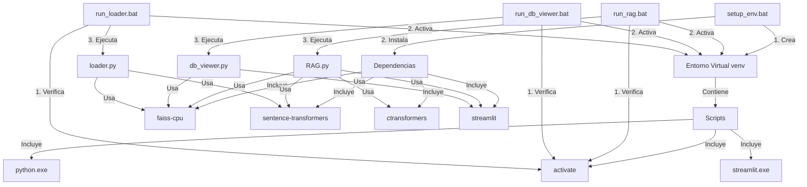

```mermaid
graph TD
    A[setup_env.bat] -->|1. Crea| B[Entorno Virtual venv]
    A -->|2. Instala| C[Dependencias]
    
    B -->|Contiene| D[Scripts]
    D -->|Incluye| E[activate]
    D -->|Incluye| F[python.exe]
    D -->|Incluye| G[streamlit.exe]
    
    C -->|Incluye| H[faiss-cpu]
    C -->|Incluye| I[sentence-transformers]
    C -->|Incluye| J[ctransformers]
    C -->|Incluye| K[streamlit]
    
    L[run_rag.bat] -->|1. Verifica| E
    L -->|2. Activa| B
    L -->|3. Ejecuta| M[RAG.py]
    
    N[run_db_viewer.bat] -->|1. Verifica| E
    N -->|2. Activa| B
    N -->|3. Ejecuta| O[db_viewer.py]
    
    P[run_loader.bat] -->|1. Verifica| E
    P -->|2. Activa| B
    P -->|3. Ejecuta| Q[loader.py]
    
    M -->|Usa| H
    M -->|Usa| I
    M -->|Usa| J
    M -->|Usa| K
    
    O -->|Usa| H
    O -->|Usa| K
    
    Q -->|Usa| H
    Q -->|Usa| I
``` 